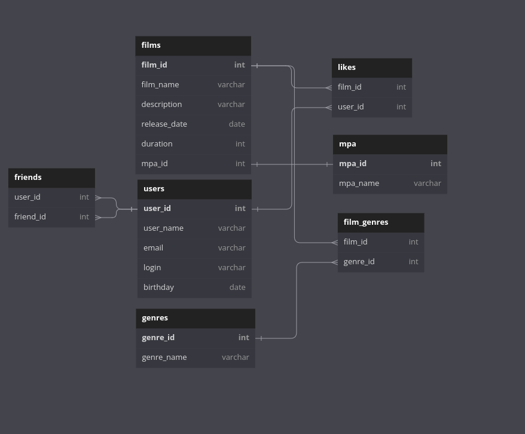

# java-filmorate


**Схема базы данных** 
<br>


**Получение всех фильмов:**

```
SELECT
    *
FROM films
```

**Получение фильма по id**

```
SELECT
    *
FROM films AS f
WHERE f.film_id = '1'
```

**Получение всех пользователей**

```
SELECT
    *
FROM users
```

**Получение пользователя по id** 

```
SELECT
    *
FROM users AS u
WHERE u.user_id = '1'
```

**Получение TOP-3 популярных фильмов**

```
SELECT
    f.film_name AS film_name,
    COUNT(DISTINCT l.user_id) AS count_likes
FROM films AS f
    LEFT JOIN likes AS l
        ON f.film_id = l.film_id
GROUP BY film_id
ORDER BY count_likes DESC
LIMIT 3
```

**Получение общих друзей**

```
SELECT
    f1.friend_id AS friend_id
FROM friends AS f1
    INNER JOIN friends AS f2
        ON f1.friend_id = f2.friend_id
WHERE f1.user_id = 'user_id'
        AND f2.user_id = 'other_id'
```

**Получение списка друзей со статусом ПОДТВЕРЖДЕН/НЕПОТВЕРЖДЕН**

```
SELECT
	f1.user_id,
	f1.friend_id,
	CASE
		WHEN f2.user_id IS NULL THEN 'НЕПОДТВЕРЖДЕН'
		ELSE 'ПОДТВЕРЖДЕН' 
	END AS status
FROM friends AS f1 
	LEFT JOIN friends AS f2
		ON f1.friend_id = f2.user_id
			AND f1.user_id = f2.friend_id
```